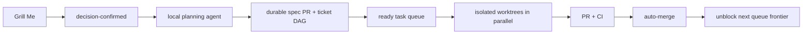

# Agent development loop

Humans only participate in **Grill Me**. Create a Grill Me issue, clarify it interactively, record final decisions in that issue, then apply `decision-confirmed`. Everything after that is agent work.



## States

| Label | Meaning |
| --- | --- |
| `grill-me` | Decision discussion; a human owns the confirmation. |
| `decision-confirmed` | Starts the brief agent. |
| `agent:brief` | Agent turns confirmed decisions into executable tickets. |
| `agent:task` | Validated executable implementation ticket. |
| `agent:queued` | Awaiting dependency-free agent dispatch. |
| `agent:running` | A worker owns this issue's isolated worktree. |
| `agent:repair` | A later worker must repair failed CI on the existing PR. |
| `agent:blocked` | Agent needs a new Grill Me decision or named authority. |
| `agent:automerge` | PR may squash-merge after required checks pass. |
| `serial-only` | Run this ticket with no sibling worker. |

`ready-for-agent` remains the gate for a fully specified task. The loop requires `Goal`, `Scope`, `Declared touch-set`, `Logical locks`, checkbox acceptance criteria, and explicit `Dependencies`; a missing field is never dispatched. Native GitHub issue dependencies are the source of truth. A parent issue is not executable unless it receives `agent:brief` or `agent:task`.

The planning agent writes `docs/specs/issue-<n>/spec.md` plus a validated `tickets.json`. The controller creates child tickets and makes every child depend on the parent before it opens/enables merge for the spec PR. The PR closes the parent only after required CI passes and it merges. Therefore no implementation starts before the decision artifact is durable. Tickets with overlapping touch-sets or logical locks must have a dependency path; otherwise they are not agent-ready. For manually authored task bodies, the controller converts every `#<number>` under `Dependencies` into a native blocked-by edge before queueing.

## Bootstrap and run

The issue workflow creates the loop labels on its first run. Apply `grill-me` to a Grill Me issue before its final confirmation. The issue workflow then turns `grill-me` + `decision-confirmed` into a queued brief automatically. A repository owner can also run **Agent loop → Run workflow → bootstrap** before the first issue.

Run one trusted, long-lived dispatcher from a clean clone:

```sh
make agent-loop-daemon
```

It polls GitHub, selects unblocked queued tasks up to `AGENT_LOOP_MAX_PARALLEL` (default 4), creates `.worktrees/issue-<n>` on `codex/issue-<n>`, and starts local executor workers concurrently. `make agent-loop-queue` is a read-only preview. `serial-only` suppresses all sibling dispatches.

Workers create a PR, CI runs, and the merge workflow queues a squash auto-merge. GitHub closing keywords close the issue on merge; the daemon sees closed dependency blockers and starts newly eligible children. A failing CI run adds `agent:repair` + `agent:queued` to the source issue, so the next worker repairs the same worktree/branch.

## Required external setup

1. Enable **Allow auto-merge** in repository settings. It is currently disabled, so the workflow can request but cannot complete autonomous merges.
2. Protect `main` with the existing `lint-and-test` and `docker-build` checks, and permit GitHub Actions to merge after checks. No secret is needed: workflows use `GITHUB_TOKEN`.
3. Install Claude Code and `gh` on one trusted machine. Authenticate `gh`, then configure the Claude process environment. For an Anthropic-compatible gateway:

   ```sh
   export AGENT_EXECUTOR=claude
   export AGENT_MODEL='<gateway-model-name>'
   export ANTHROPIC_BASE_URL='https://<gateway-host>'
   export ANTHROPIC_AUTH_TOKEN='<gateway-token>'
   export AGENT_LOOP_MAX_PARALLEL=4
   make agent-loop-daemon
   ```

   Use `ANTHROPIC_API_KEY` instead when the gateway expects `x-api-key`. Put these values in the daemon/service environment, never repository files, issues, logs, or workflow literals. The child Claude process inherits them.
4. Keep exactly one dispatcher daemon per clone. The dispatcher stays local because it owns persistent worktrees; GitHub Actions only transitions issue state, reports CI health, and requests gated merges.

The default adapter is `scripts/agent/executors/claude.sh`. It runs non-interactive `claude -p`, JSON output, a turn limit, the optional `AGENT_MODEL`, and unattended permissions. Tune it with `AGENT_CLAUDE_BIN`, `AGENT_CLAUDE_PERMISSION_MODE`, `AGENT_CLAUDE_ALLOWED_TOOLS`, and `AGENT_MAX_TURNS`.

The control plane is provider-neutral. Set `AGENT_EXECUTOR_ADAPTER=/absolute/path/to/executable` to replace Claude. The adapter receives `AGENT_WORKTREE`, `AGENT_TASK_FILE`, and `AGENT_OUTPUT_FILE`; exit zero only when the agent run completed. `AGENT_EXECUTOR=<name>` alternatively selects `scripts/agent/executors/<name>.sh`.

The model runs with an empty GitHub CLI config and a disabled git remote. It only leaves a worktree diff. The controller then validates changed paths or the planning schema/DAG, runs a second review-agent pass, executes `make check`, commits, pushes, opens/updates the PR, materializes child issues and native dependency edges, and enables gated auto-merge. GitHub publication credentials never appear in prompts or repository literals.

Treat the runner host as trusted automation infrastructure. Logs and executor results live under `.worktrees/issue-<n>.*`; correlate them with issue, branch, PR, and GitHub Actions checks. A failed worker moves the issue to `agent:blocked`; failed CI adds `agent:repair` and requeues the existing branch. A missing worker PID recovers a stale claim on the next poll. Closed issues remove their generated worktree, branch, and local artifacts. The daemon unlocks downstream tickets as native blockers close.
