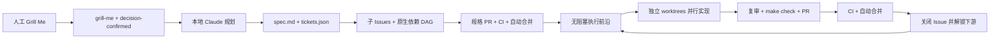

# Agent 开发闭环：安装、配置与使用

本文面向使用和维护 InsureDesk 的团队成员。它解释为什么需要这套闭环、第一次怎样启用、日常要看什么，以及失败时怎样安全恢复。人工只负责完成 **Grill Me** 并确认决策；确认后的规格沉淀、拆票、依赖编排、并行实现、复审、测试、提交、PR、CI、合并和下游解锁由本地 Claude 与 GitHub 自动完成。

> `codex/issue-<n>` 只是当前分支命名约定。执行器默认是本地 Claude，不需要 Codex，也不会调用 `codex exec`。

## 快速开始清单

首次启用：

- [ ] 合并包含本闭环的代码，并让运行机同步最新 `main`
- [ ] 安装 Git、GitHub CLI、Node/pnpm、Docker、Claude Code 和 `jq`
- [ ] `gh auth status` 正常，账号可写 Issues、分支和 PR
- [ ] GitHub 开启 auto-merge、Actions 写权限和 `main` 分支保护
- [ ] `main` 要求 `lint-and-test` 与 `docker-build` 两项检查
- [ ] 运行 **Agent loop → Run workflow → bootstrap** 创建标签
- [ ] 在运行机环境中注入 provider URL、model 和 key
- [ ] `make agent-loop-queue` 可正常读取队列
- [ ] `make agent-loop-daemon` 启动唯一 dispatcher

每次需求：

- [ ] 用 **Grill Me** issue 表单创建决策 issue
- [ ] 完成讨论，把最终结论写入 **Confirmed decisions**
- [ ] 添加 `grill-me`，确认无误后再添加 `decision-confirmed`
- [ ] 之后不再手动拆票或派工，只关注 `agent:blocked`、PR 与 CI

## 闭环如何工作



本地机器运行 `scripts/agent-loop.sh daemon`，GitHub Actions 只负责 issue 状态转换、CI 失败回写和受保护分支上的自动合并。Claude 进程只留下未提交 diff；controller 才能验证、提交、推送、创建 PR 和修改 Issues。

### 人与系统的分工

| 阶段 | 人要做什么 | 自动完成什么 |
| --- | --- | --- |
| 决策 | 创建 Grill Me issue、回答问题、写清最终决定并确认 | 不提前写代码 |
| 规划 | 正常情况下无需操作 | 把决定写成持久规格，拆成有验收条件和依赖的 tickets |
| 实现 | 只处理明确标记的异常 | 选择无阻塞 tickets，在隔离 worktree 并行实现、复审和测试 |
| 集成 | 观察 PR/CI；失败需要新决定时介入 | 提交、推送、建 PR、修复 CI、自动合并、关闭 issue、解锁下游 |

核心原则：人确认“要做什么”，系统负责“怎样可靠地做完”；没有明确进入自动队列的 issue 不会被执行。

## 1. 前置条件

### GitHub 权限

运行 daemon 的 GitHub 账号至少需要：

- 读取仓库、Issues、PR 与 Actions 日志
- 创建和编辑 Issues、标签、sub-issues 与原生 dependency edges
- 创建并推送 `codex/issue-<n>` 分支
- 创建和编辑 PR

检查登录：

```sh
gh auth status
gh repo view LkxPro/insuredesk --json nameWithOwner
```

### 本地工具

运行机需要：

- Git 与 GitHub CLI `gh`
- Node.js：版本由仓库 `.nvmrc` 固定
- pnpm：版本由 `package.json` 的 `packageManager` 固定
- Docker：`make check` 的 API 测试使用 Testcontainers
- `jq`
- Claude Code CLI：命令名默认是 `claude`

基础检查：

```sh
git --version
gh --version
node --version
pnpm --version
docker info
jq --version
claude --version
```

从一个干净、长期保留的 clone 运行 daemon。不要从临时 worktree 或日常开发中的脏 clone 启动。

## 2. 配置本地 Claude 与自定义 provider

### 必需配置

本项目的默认 adapter 是 `scripts/agent/executors/claude.sh`。对于自定义 Anthropic-compatible provider，运行 daemon 的进程环境需要：

| 变量 | 必需性 | 说明 |
| --- | --- | --- |
| `ANTHROPIC_BASE_URL` | 自定义 provider 必需 | Provider/Gateway 的 Anthropic-compatible base URL |
| `ANTHROPIC_AUTH_TOKEN` | 二选一 | Provider 使用 `Authorization: Bearer` 时设置 |
| `ANTHROPIC_API_KEY` | 二选一 | Provider 使用 `x-api-key` 时设置 |
| `AGENT_MODEL` | 本团队配置必需 | 传给 Claude CLI 的 `--model`；adapter 技术上允许省略 |

只设置 `ANTHROPIC_AUTH_TOKEN` 或 `ANTHROPIC_API_KEY` 中符合 provider 要求的一个。安全示例：

```sh
export AGENT_EXECUTOR='claude'
export AGENT_MODEL='<your-provider-model-name>'
export ANTHROPIC_BASE_URL='https://llm-gateway.example.com'
export ANTHROPIC_AUTH_TOKEN='<inject-from-your-secret-manager>'
```

如果 provider 要求 `x-api-key`：

```sh
unset ANTHROPIC_AUTH_TOKEN
export ANTHROPIC_API_KEY='<inject-from-your-secret-manager>'
```

这些是占位符，不是可用凭据。不要把真实 key 写入仓库 `.env`、issue、PR、workflow、shell history 或团队文档。推荐由密码管理器、系统服务环境或 secrets manager 在进程启动时注入。

Worker 会给 Claude 一个临时 `HOME`，不会依赖个人 `~/.claude` 登录状态；provider 凭据必须通过 daemon 环境传入。

### 可选运行参数

| 变量 | 默认值 | 用途 |
| --- | --- | --- |
| `AGENT_LOOP_MAX_PARALLEL` | `4` | 整个 clone 同时运行的最大 worker 数 |
| `AGENT_LOOP_INTERVAL` | `30` | daemon 轮询间隔，单位秒 |
| `AGENT_LOOP_WORKTREES` | `<repo>/.worktrees` | worktree、PID、日志与结果目录 |
| `AGENT_CLAUDE_BIN` | `claude` | Claude CLI 可执行文件 |
| `AGENT_MAX_TURNS` | `80` | 单次 Claude 非交互运行最大 turns |
| `AGENT_CLAUDE_ALLOWED_TOOLS` | `Bash,Read,Edit,Write,Glob,Grep` | Claude 可用工具 |
| `AGENT_CLAUDE_PERMISSION_MODE` | `bypassPermissions` | Claude permission mode |
| `AGENT_REVIEW_ENABLED` | `1` | `1` 时实现后再运行一次 review Agent |

推荐先从并发 2 开始，确认 provider 限流、机器内存和 Docker 容量后再调高：

```sh
export AGENT_LOOP_MAX_PARALLEL=2
export AGENT_LOOP_INTERVAL=30
```

### Provider-neutral adapter

默认不需要改。如果未来不用 Claude，可设置：

```sh
export AGENT_EXECUTOR_ADAPTER='/absolute/path/to/custom-adapter'
```

自定义 adapter 会收到：

- `AGENT_WORKTREE`：独立 worktree 路径
- `AGENT_TASK_FILE`：本次 prompt/task 文件
- `AGENT_OUTPUT_FILE`：执行结果输出路径

成功必须退出 `0`；失败必须非零退出。也可设置 `AGENT_EXECUTOR=<name>`，加载仓库内 `scripts/agent/executors/<name>.sh`。

## 3. 配置 GitHub 仓库

需要仓库管理员完成一次。

### 开启 auto-merge

进入 **Settings → General → Pull Requests**：

1. 开启 **Allow auto-merge**。
2. 保持允许 squash merge；`Agent merge` workflow 使用 squash。

### 保护 `main`

进入 **Settings → Branches** 或仓库 Rulesets，为 `main` 建立规则：

1. Require a pull request before merging。
2. Require status checks to pass before merging。
3. 选择精确检查名：
   - `lint-and-test`
   - `docker-build`
4. 建议 Require branches to be up to date before merging。
5. 禁止 force push 和删除 `main`。

正常闭环要求无需人工 review 即可合并。若规则要求人工 approval，自动化会停在 PR 等待人工审批。

### Actions 权限

进入 **Settings → Actions → General → Workflow permissions**：

1. 选择 **Read and write permissions**。
2. 无需允许 Actions 创建或批准 PR；PR 由本地 controller 创建，workflow 只请求 auto-merge。

仓库 workflow 使用内置 `GITHUB_TOKEN`，无需新增 provider secret；provider key 只存在于本地 daemon 环境。

### Issue 功能

确认仓库可使用：

- GitHub Issues
- sub-issues
- native issue dependencies / blocked-by edges

依赖边是调度唯一事实源。Issue 正文中的 `Dependencies` 用于输入；controller 会将其中的 `#<number>` 转为原生 blocked-by edge。

## 4. 一次性初始化

### 4.1 同步并验证 clone

```sh
git switch main
git pull --ff-only origin main
make check
```

### 4.2 创建闭环标签

推荐从 GitHub UI 运行：

1. 打开 **Actions → Agent loop**。
2. 选择 **Run workflow**。
3. `action` 选择 `bootstrap`。
4. 运行并确认 workflow 成功。

也可由有权限的本地账号执行：

```sh
sh scripts/agent-loop.sh bootstrap
```

CLI 也可触发同一 workflow：

```sh
gh workflow run agent-loop.yml -f action=bootstrap
gh run watch
```

该操作是幂等的，只创建不存在的 Agent 标签。仓库原有的 `needs-triage` 和 `ready-for-agent` 也必须保留；可用 `gh label list` 检查。

### 4.3 验证环境和队列

在已经注入 Claude/provider 环境变量的同一个终端中：

```sh
claude --version
gh auth status
make agent-loop-queue
```

`make agent-loop-queue` 是只读预览。stdout 输出本轮可派发的 issue number；stderr 可能显示 `blocked-by-dependency`、`logical-lock`、`touch-set`、`invalid-contract` 或 `capacity` 等跳过原因。

## 5. 谁创建 Issue 都会自动运行吗？

**作者身份不影响执行。** Workflow 和 dispatcher 都不检查 issue 作者、团队或创建方式。因此，其他团队成员创建的 issue 也能运行，但前提是团队明确把它加入自动闭环，并且满足全部准入条件。若创建者没有标签权限，由维护者完成最后的 opt-in。

这不是“创建任意 issue 就立即执行”：

- 普通 issue 只有 `needs-triage` 等标签时，不会进入队列。
- Grill Me issue 必须是 open，并同时有 `grill-me` 与 `decision-confirmed`；workflow 才会把它变成规划任务。
- 手工 Agent task 必须是 open、添加 `ready-for-agent`，并完整填写 Goal、Scope、Acceptance criteria、Declared touch-set、Logical locks、Dependencies 和 Test plan。
- 真正领取前还必须有 `agent:brief` 或 `agent:task`、`agent:queued`，没有 open blocker，不与其他 worker 的 touch-set / logical lock 冲突，并且有空闲并发槽。

`Agent loop` 会在 issue 创建、编辑、加/删标签、关闭或重开时重新检查。手工任务不完整却被添加 `ready-for-agent` 时，系统会移除 `ready-for-agent`、`agent:queued`、`agent:task`，添加 `needs-info`；dispatcher 领取前还会再次验证，因此缺字段不会靠竞态绕过检查。

团队应这样明确选择：

- **加入正常闭环：** 使用 Grill Me 表单；完成讨论后添加 `grill-me` 与 `decision-confirmed`。
- **加入已明确的单任务：** 使用 Agent task 表单；维护者检查后添加 `ready-for-agent`。
- **不加入：** 不添加上述确认标签；普通 bug、咨询和草稿 issue 保持常规 triage。
- **领取前退出：** 手工任务移除 `ready-for-agent`。Grill Me 任务先移除 `decision-confirmed`，再移除 `ready-for-agent`；关闭 issue 也会退出。
- **已经 `agent:running`：** 不要只删标签；先按“停用、回滚与恢复”停止本地执行，再检查 worktree、PR 和 issue 状态。

## 6. 人工如何完成 Grill Me 并交棒

### 6.1 创建决策 Issue

在 GitHub 选择 **New issue → Grill Me**，填写：

- **Outcome to decide**：要确认的最终结果
- **Context and constraints**：现状、约束、非目标、风险、相关链接
- **Confirmed decisions**：先记录讨论中的决定，最终必须整理完整

表单初始标签是 `needs-triage`。

### 6.2 进行 Grill Me

1. 给 issue 添加 `grill-me`，表示仍处于人工决策阶段。
2. 逐项澄清产品、技术、边界、回滚和验收。
3. 把最终共识写回 **Confirmed decisions**，不要只留在聊天记录中。
4. 最后检查不存在待定选项、`TBD` 或互相冲突的决定。

### 6.3 确认交棒

只有决策最终确认后，才添加 `decision-confirmed`。必须同时存在：

- `grill-me`
- `decision-confirmed`

`Agent loop` workflow 会把它转换为：

- `ready-for-agent`
- `agent:brief`
- `agent:queued`

至此人工正常流程结束。不要手动创建子票、关闭父 issue 或添加 `agent:running`。

## 7. 规划、Tickets 与依赖 DAG

规划阶段会把决策转成两个可审查、可长期保存的文件：

```text
docs/specs/issue-<parent>/spec.md
docs/specs/issue-<parent>/tickets.json
```

`tickets.json` 中每张 ticket 必须包含：

- `key`：小写 kebab-case，且在 plan 内唯一
- `title`、`goal`
- 非空 `acceptanceCriteria`、`outOfScope`、`touchSet`、`testPlan`
- `logicalLocks`、`dependsOn` 数组
- `serialOnly` 布尔值

系统会拒绝：

- 缺字段或空字段
- 未知依赖
- dependency cycle
- touch-set 或 logical lock 重叠、却没有依赖顺序的 tickets

验证通过后，系统：

1. 创建 GitHub child issues。
2. 建立 sub-issue 关系。
3. 让每个 child 都 blocked by 父 decision issue。
4. 按 `dependsOn` 建立 child 之间的 native dependency edges。
5. 给 child 添加 `agent:task`、`ready-for-agent`、`agent:queued`；需要独占时再加 `serial-only`。
6. 创建 durable-spec PR，并添加 `agent:automerge`。

父 issue 由 spec PR 的 `Closes #<parent>` 在合并时关闭。父 issue 未关闭前，所有 child 都被原生依赖阻塞，不会提前实现。

### 手工 Agent task（例外入口）

正常路径由 planning Agent 自动建票。如需手工加入一个已完全明确的任务，使用 **New issue → Agent task**，完整填写：

- Goal
- Scope
- Acceptance criteria（至少一个 checkbox）
- Declared touch-set（不能是 `None`）
- Logical locks（无锁填 `- None`）
- Dependencies（无依赖填 `- None`；有依赖写 `#123`）
- Test plan（不能是 `None`）

表单只添加 `needs-triage`。维护者确认内容完整后添加 `ready-for-agent`；workflow 验证正文、同步原生 dependency edges，然后添加 `agent:task` 与 `agent:queued`。验证失败会移除队列标签并添加 `needs-info`。

## 8. 启动、查看和停止 daemon

### 前台启动（推荐首次使用）

```sh
make agent-loop-daemon
```

它每 `AGENT_LOOP_INTERVAL` 秒执行一次 dispatch。按 `Ctrl-C` 停止 dispatcher；已经启动的 worker 是独立后台进程，会继续完成当前任务，但不会再领取新任务。

### 只跑一轮

```sh
make agent-loop-queue
make agent-loop-dispatch
```

- `agent-loop-queue`：只读预览当前 frontier。
- `agent-loop-dispatch`：清理已关闭 worktree、恢复 stale claim，并启动一轮可执行 tickets。

### 后台启动

`.worktrees/` 已被 gitignore，可用于 daemon 日志和 PID：

```sh
mkdir -p .worktrees
nohup sh scripts/agent-loop.sh daemon >.worktrees/daemon.log 2>&1 &
echo $! >.worktrees/daemon.pid
```

查看和停止：

```sh
tail -f .worktrees/daemon.log
kill "$(cat .worktrees/daemon.pid)"
rm -f .worktrees/daemon.pid
```

生产式长期运行建议由 launchd、systemd 或同类 supervisor 托管，并在 service 环境中注入变量。不要把 key 写入 service 文件仓库副本。

上述日志路径假设未修改 `AGENT_LOOP_WORKTREES`。命令启动后，`tail` 应周期性显示派发结果；没有合格 issue 时保持空闲是正常状态。

## 9. 标签与状态

### Issue 标签

| 标签 | 含义 | 谁设置 |
| --- | --- | --- |
| `needs-triage` | 尚待确认是否可执行 | Issue form / workflow |
| `needs-info` | 合约缺失，需要补充 | workflow |
| `ready-for-human` | 需要人工实现 | 维护者 |
| `grill-me` | 正在进行人工 Grill Me | 人工 |
| `decision-confirmed` | 人工确认最终决定 | 人工；正常流程唯一审批点 |
| `ready-for-agent` | 可进入自动调度入口 | workflow / 经确认的手工票 |
| `agent:brief` | 规划任务：生成 spec 与 tickets | workflow |
| `agent:task` | 已验证的实现 ticket | controller / workflow |
| `agent:queued` | 等待进入 dependency-free frontier | controller / workflow |
| `agent:running` | 本地 worker 已领取 | dispatcher |
| `agent:repair` | 现有 PR 的 CI 需要修复 | `Agent PR health` workflow |
| `agent:blocked` | Agent 无法安全继续 | worker/controller |
| `serial-only` | 必须独占全部并行槽位 | planning/controller |

### PR 标签

| 标签 | 含义 |
| --- | --- |
| `agent:automerge` | `Agent merge` workflow 可请求 squash auto-merge |

不要手动添加 `agent:running`、`agent:repair` 或 `agent:automerge` 来跳过状态机。

## 10. 并行、依赖与冲突规则

Scheduler 只选择同时满足以下条件的 issues：

- open
- 同时具有 `ready-for-agent` 与 `agent:queued`
- 具有 `agent:brief` 或完整有效的 `agent:task` 合约
- native `blocked_by` 数量为 0
- 未超过 `AGENT_LOOP_MAX_PARALLEL`
- 不与正在运行或本轮已选择 ticket 的 touch-set / logical locks 冲突

### Declared touch-set

Touch-set 是仓库相对路径或 glob，例如：

```text
- apps/api/src/services/**
- packages/shared/src/ticket.ts
```

路径前缀重叠会串行。例如 `apps/api/**` 与 `apps/api/src/index.ts` 冲突。Worker 完成后，controller 会检查实际 changed files；任何超出 touch-set 的修改都会进入 `agent:blocked`，不会发布 PR。

### Logical locks

Logical lock 用于路径无法表达的共享所有权，例如：

```text
- ticket-contract
- prisma-schema
```

同名 lock 不能并行。无 lock 写 `- None`。

### `serial-only`

如果 ticket 必须独占整个仓库执行窗口，添加 `serial-only`：

- 已有 `serial-only` 正在运行时，不派发任何新任务。
- 可运行的 `serial-only` 在没有 running worker 时单独启动。

## 11. Worker、PR、CI 与合并

每个 issue 使用：

- worktree：`.worktrees/issue-<n>`
- branch：`codex/issue-<n>`
- log：`.worktrees/issue-<n>.log`
- implementation result：`.worktrees/issue-<n>.implementation.json`
- review result：`.worktrees/issue-<n>.review.json`
- PID：`.worktrees/issue-<n>.pid`

执行顺序：

1. Implementation Agent 在隔离 worktree 修改代码。
2. Review Agent 复查 diff，并可修复具体缺陷。
3. Controller 验证未改 git history、修改未越过 touch-set。
4. Controller 强制运行 `make check`。
5. 全部通过后 controller commit、push、创建或更新 PR。
6. PR 添加 `agent:automerge`。
7. GitHub `CI` workflow 运行 `lint-and-test` 与 `docker-build`。
8. `Agent merge` 请求 squash auto-merge。
9. 合并关闭关联 issue；下游 native dependency 自动解除。
10. daemon 下一轮计算新的 frontier。

如果 CI 失败，`Agent PR health` 会给源 issue 添加 `agent:repair` 与 `agent:queued`。下一次 worker 会复用同一 worktree、branch 和 PR，重新经过 review 与 `make check`。当前 controller 不会自动下载 failed Actions log；若仅靠本地复现无法定位，值守人员需从 PR Actions 页面查看失败步骤，并把必要且不含秘密的诊断信息补充到 issue。

## 12. 日常值守流程

每天建议：

1. 确认 daemon 存活。
2. 预览 frontier 与跳过原因。
3. 查看 `agent:blocked` 和 `needs-info`。
4. 查看 agent PR 与 CI。
5. 只处理真正需要决策或外部权限的异常。

常用命令：

```sh
# 当前可执行前沿
make agent-loop-queue

# 正在运行的 issues
gh issue list --label agent:running --state open

# 等待队列
gh issue list --label agent:queued --state open

# 需要人工诊断
gh issue list --label agent:blocked --state open
gh issue list --label needs-info --state open

# Agent PR
gh pr list --label agent:automerge --state open

# 最近 CI
gh run list --workflow CI --limit 10
```

## 13. 可观测性与故障排查

### Worker 在做什么？

```sh
tail -f .worktrees/issue-123.log
jq . .worktrees/issue-123.implementation.json
jq . .worktrees/issue-123.review.json
git -C .worktrees/issue-123 status
git -C .worktrees/issue-123 diff
```

Issue 评论会记录 stale-claim 恢复、PR 发布和失败原因。再结合 branch、PR 与 Actions run 可串起完整链路。

### `make agent-loop-queue` 没有输出

依次检查：

1. Issue 是否同时有 `ready-for-agent` 与 `agent:queued`。
2. 是否有 `agent:brief` 或 `agent:task`。
3. `Dependencies` 是否仍有 open blocker。
4. 是否被 running ticket 的 touch-set / logical lock 挡住。
5. 是否达到 `AGENT_LOOP_MAX_PARALLEL`。
6. stderr 是否显示 `invalid-contract`、`invalid-touch-set`、`capacity` 等原因。

### Issue 进入 `agent:blocked`

先查看：

```sh
gh issue view 123 --comments
tail -n 200 .worktrees/issue-123.log
```

修复根因后，维护者可移除 `agent:blocked`，重新添加 `agent:queued`。不要在未理解失败原因时反复重试；provider、scope、测试、依赖或外部权限问题不会靠重跑自动消失。

### `agent:running` 但没有进程

每个 running issue 应有 `.worktrees/issue-<n>.pid`。下一次 `dispatch` 会检查 PID；进程不存在时会移除 `agent:running`、恢复 `agent:queued` 并写 issue 评论：

```sh
make agent-loop-dispatch
```

### CI 失败没有重试

检查：

```sh
gh run list --workflow "Agent PR health" --limit 10
gh pr view <pr-number> --json headRefName,labels,statusCheckRollup
```

Agent branch 必须是 `codex/issue-<n>`，PR 必须仍 open 且有 `agent:automerge`，`Agent PR health` 才能映射回 issue。

### PR 未自动合并

确认：

- repository 已开启 **Allow auto-merge**
- PR 不是 draft
- PR 有 `agent:automerge`
- `lint-and-test` 与 `docker-build` 均通过
- `main` 规则没有额外人工 approval 或其他未满足检查
- Actions 有写权限

### Provider/Claude 失败

从运行 daemon 的同一环境检查：

```sh
claude --version
test -n "$ANTHROPIC_BASE_URL" && echo 'base URL set'
test -n "${ANTHROPIC_AUTH_TOKEN:-}${ANTHROPIC_API_KEY:-}" && echo 'credential set'
test -n "$AGENT_MODEL" && echo 'model set'
```

不要打印 credential 本身。认证、未知 model、429 或超时详情见 `.worktrees/issue-<n>.log`。

## 14. Secrets 与运行机安全

- 永远不要 commit provider key、token 或自定义 header。
- 不要把 key 写进 GitHub issue、PR、Actions variable 或普通日志。
- 给 daemon 使用专用 GitHub 账号/凭据，只授予本仓库所需权限。
- 运行机应专用且可信；Claude 默认使用 unattended `bypassPermissions`。
- Worker 启动 Claude 时清空 `GH_TOKEN`/`GITHUB_TOKEN`、使用临时 GitHub 配置，并用进程级 Git 配置覆盖 origin URL；这能降低误发布风险，但不是安全沙箱。
- Claude 拥有本地 `Bash` 和 `bypassPermissions`，理论上可改变自身环境或读取运行账号可访问的文件。只在专用可信运行机上使用，避免该账号能读取无关凭据；controller 才是团队约定的唯一发布方。
- 定期轮换 provider key，限制 provider 配额与并发。
- `.worktrees/issue-<n>.log` 与结果可能含 issue 内容或模型输出，应按内部工程日志处理。

## 15. 停用、回滚与恢复

### 暂停领取新任务

停止 daemon：

```sh
kill "$(cat .worktrees/daemon.pid)" 2>/dev/null || true
rm -f .worktrees/daemon.pid
```

如果是前台运行，按 `Ctrl-C`。已启动 worker 会继续；仅停止 dispatcher 不会杀掉它们。

### 请求停止所有本地 worker

先确认目标 PID 文件只位于本仓库 `.worktrees`：

```sh
for pid_file in .worktrees/issue-*.pid; do
  [ -f "$pid_file" ] || continue
  kill "$(cat "$pid_file")"
done
```

对应 issues 可能暂留 `agent:running`。保留 worktree 与日志用于诊断；重新启动后，下一轮 dispatch 会恢复 stale claims。

PID 指向 worker wrapper；停止后用 `ps` 和日志确认其子进程也已退出。系统目前没有“一键强停并回滚所有执行”的事务操作，因此生产值守优先采用“停 daemon、等待已有 worker 完成”。

### 禁用 GitHub 控制面

在 **Actions** 中分别禁用：

- `Agent loop`
- `Agent merge`
- `Agent PR health`

同时停止本地 daemon。这样不会再自动转换 issue、回写 CI 或请求合并。已有 PR 不会自动撤销；按普通 GitHub 流程关闭或处理。

### 从 `agent:blocked` 恢复

1. 阅读 issue 评论与 `.worktrees/issue-<n>.log`。
2. 修复 provider、依赖、scope、测试或权限问题。
3. 必要时在 issue 中记录新的人工决定。
4. 移除 `agent:blocked`，添加 `agent:queued`。
5. 用 `make agent-loop-queue` 确认后，再运行 daemon/dispatch。

### 回滚已合并代码

闭环只使用普通 squash PR。业务代码回滚仍遵循仓库常规方式：为目标 merge commit 创建 revert PR，让现有 CI 检查通过后合并。不要删除 issue、spec 或 dependency 记录来伪造回滚状态。

## 16. 术语表

| 术语 | 通俗解释 |
| --- | --- |
| Grill Me | 人工把模糊需求问清楚并作出最终决定的阶段 |
| Agent loop / 闭环 | 从已确认决定到规划、实现、CI、合并和状态回写的整套自动流程 |
| daemon / dispatcher | 长期运行在本地机器、定期寻找可执行 issue 并启动 worker 的进程 |
| worker | 一次只负责一个 issue 的本地执行进程 |
| controller | worker 中负责验证、测试、提交、推送和更新 GitHub 的确定性脚本；不是模型 |
| adapter | 把统一任务交给具体模型 CLI 的薄接口；默认连接本地 Claude |
| ticket contract | Agent task 必须完整提供的 Goal、Scope、验收、修改范围、锁、依赖和测试计划 |
| DAG | 有向无环依赖图；保证上游完成后下游才开始，且依赖不会循环 |
| frontier | 当前所有依赖都已满足、可立即领取的一组 tickets |
| worktree | 同一 Git 仓库的隔离工作目录；每个 issue 在自己的目录和分支中修改 |
| touch-set | ticket 声明允许修改的文件或目录范围，也是并行冲突判断依据 |
| logical lock | 文件路径无法表达时，对共享契约、schema 等资源使用的互斥名称 |
| stale claim | issue 标记为运行中，但对应本地进程已经不存在的过期领取状态 |

## 17. 故障定位文件索引

| 文件 | 职责 |
| --- | --- |
| `.github/ISSUE_TEMPLATE/grill-me.yml` | 人工决策入口 |
| `.github/ISSUE_TEMPLATE/agent-task.yml` | 手工完整任务的例外入口 |
| `.github/workflows/agent-loop.yml` | 标签 bootstrap、issue 状态转换、frontier 报告 |
| `.github/workflows/agent-pr-health.yml` | CI 失败回写 repair queue |
| `.github/workflows/agent-merge.yml` | `agent:automerge` PR 的 squash auto-merge |
| `scripts/agent-loop.sh` | queue、dispatch、daemon、stale recovery、cleanup |
| `scripts/agent-worker.sh` | Agent、复审、验证、测试、发布与状态回写 |
| `scripts/agent/frontier.mjs` | 依赖、并发、touch-set、logical-lock 调度 |
| `scripts/agent/plan.mjs` | 规划 schema、DAG 与冲突验证 |
| `scripts/agent/materialize-plan.sh` | child issues、sub-issues 与 native dependencies |
| `scripts/agent/verify-touch-set.mjs` | 实际 changed files 范围检查 |
| `scripts/agent/run-executor.sh` | Provider-neutral adapter 入口 |
| `scripts/agent/executors/claude.sh` | 默认本地 Claude adapter |
