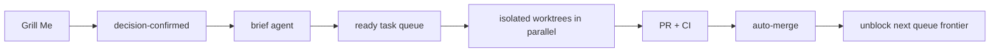

# Agent development loop

Humans only participate in **Grill Me**. Create a Grill Me issue, clarify it interactively, record final decisions in that issue, then apply `decision-confirmed`. Everything after that is agent work.



## States

| Label | Meaning |
| --- | --- |
| `grill-me` | Decision discussion; a human owns the confirmation. |
| `decision-confirmed` | Starts the brief agent. |
| `agent:brief` | Agent turns confirmed decisions into executable tickets. |
| `agent:task` | Validated executable implementation ticket. |
| `agent:queued` | Awaiting dependency-free agent dispatch. |
| `agent:running` | A worker owns this issue's isolated worktree. |
| `agent:repair` | A later worker must repair failed CI on the existing PR. |
| `agent:blocked` | Agent needs a new Grill Me decision or named authority. |
| `agent:automerge` | PR may squash-merge after required checks pass. |
| `serial-only` | Run this ticket with no sibling worker. |

`ready-for-agent` remains the gate for a fully specified task. The loop requires `Goal`, `Scope`, checkbox acceptance criteria, and explicit `Dependencies`; a missing field is never dispatched. Native GitHub issue dependencies are the source of truth. A parent issue is not executable unless it receives `agent:brief` or `agent:task`.

## Bootstrap and run

The issue workflow creates the loop labels on its first run. Apply `grill-me` to a Grill Me issue before its final confirmation. The issue workflow then turns `grill-me` + `decision-confirmed` into a queued brief automatically. A repository owner can also run **Agent loop → Run workflow → bootstrap** before the first issue.

Run one trusted, long-lived dispatcher from a clean clone:

```sh
make agent-loop-daemon
```

It polls GitHub, selects every unblocked queued task, creates `.worktrees/issue-<n>` on `codex/issue-<n>`, and starts Codex workers concurrently. `make agent-loop-queue` is a read-only preview. `serial-only` suppresses all sibling dispatches.

Workers create a PR, CI runs, and the merge workflow queues a squash auto-merge. GitHub closing keywords close the issue on merge; the daemon sees closed dependency blockers and starts newly eligible children. A failing CI run adds `agent:repair` + `agent:queued` to the source issue, so the next worker repairs the same worktree/branch.

## Required external setup

1. Enable **Allow auto-merge** in repository settings. It is currently disabled, so the workflow can request but cannot complete autonomous merges.
2. Protect `main` with the existing `lint-and-test` and `docker-build` checks, and permit GitHub Actions to merge after checks. No secret is needed: workflows use `GITHUB_TOKEN`.
3. Keep one trusted machine logged into `gh` and Codex running `make agent-loop-daemon`. The dispatcher deliberately does not run inside GitHub Actions: Actions cannot create Codex sessions or retain isolated worktrees after a job ends.

The runner starts Codex from disposable issue worktrees with its unattended sandbox bypass. Treat the whole runner host as trusted automation infrastructure.
