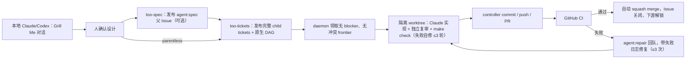

# GitHub Issue Agent 开发闭环：团队上手与运行指南

本文面向团队成员。正常流程只有设计阶段需要人：在本地 Claude/Codex 中完成 Grill Me，确认后调用 `too-tickets`（大改动先 `too-spec` 再 `too-tickets`；小任务可跳过 spec 直接 parentless 发布）。GitHub 从"已确认规格/票据"开始记录工作；本地 Claude daemon 自动并行实现、测试、复审、发 PR、修 CI 并合并。

> GitHub Issue 不是 Grill Me 聊天窗口。不要把未确认的设计问题发布为 Issue。

## 快速清单

- [ ] 安装 `git`、`gh`、`jq`、Node/pnpm、Docker、Claude CLI
- [ ] `gh auth status` 成功，且有 Issue、PR、Actions、Contents 写权限
- [ ] 本机 `claude` 可正常交互使用（订阅登录或 settings.json provider）
- [ ] GitHub 开启 auto-merge；`main` 要求 `lint-and-test`、`docker-build`
- [ ] 运行一次 `node scripts/agent/main.ts bootstrap`
- [ ] 启动 `make agent-loop-daemon`
- [ ] 本地运行 Grill Me；明确确认设计
- [ ] 调用 `too-spec`，取得父 Issue 号（小任务可跳过）
- [ ] 调用 `too-tickets`；child 自动建票、连依赖、入队
- [ ] 用 `make agent-loop-queue`、`.worktrees/*.log`、PR Checks 观察

## 1. 实际工作流



人负责：

1. 在本地对话中回答 Grill Me 的单个设计问题。
2. 明确确认已达成共同理解。
3. 调用 `too-tickets`（大改动先 `too-spec` 再带 parent 调用；小任务 parent 传 0）。

自动完成：

- 规格和 ticket 正文标准化
- child/sub-issue 创建
- GitHub 原生 dependency edges
- `ready-for-agent` 与队列状态
- 无依赖 frontier 的并行领取
- worktree、分支、实现、复审、测试、commit、PR
- CI 失败回队、成功自动合并、下游解锁

## 2. 前置条件

本机需要：

- POSIX shell（macOS/Linux）
- `git`、`gh`、`jq`
- 仓库要求的 Node、pnpm、Docker
- Claude CLI；默认命令名为 `claude`
- 本地 Claude/Codex 中可用 Grill Me skill 或同等的逐题设计访谈

检查：

```sh
git --version
gh --version
jq --version
docker version
claude --version
gh auth status
make check
```

仓库内已提供 `too-spec`、`too-tickets` 的项目级技能适配。Claude Code 通常用 `/too-spec`、`/too-tickets`；Codex 用 `$too-spec`、`$too-tickets` 或直接说“使用 too-spec/too-tickets”。

## 3. 配置本地 Claude

Worker 里的 claude 使用本机默认配置与凭据（订阅登录 Keychain、或 `~/.claude/settings.json` 里的 provider 配置），代码不感知账户。启动 daemon 的同一个本机用户能正常交互使用 `claude` 即可。

可选覆盖：

```sh
export AGENT_LOOP_MAX_PARALLEL=4
export AGENT_LOOP_INTERVAL=30
export AGENT_CLAUDE_BIN='claude'
export AGENT_MODEL='override-model'        # 默认不传，用本机配置的模型
export AGENT_MAX_TURNS=80                  # 默认不传，不限轮次;设了则按 implementation+fix 长存会话累计
export AGENT_REVIEW_ENABLED=1
export AGENT_COMMENT_SWEEP_ENABLED=1        # make check 通过后跑注释清扫，删违规注释后有改动会重跑 check
export AGENT_FIX_MAX_ROUNDS=3              # make check 失败后 worker 内部修复轮次
export AGENT_REPAIR_MAX_ATTEMPTS=3         # PR CI 失败后回队修复上限
export AGENT_CLAUDE_PERMISSION_MODE=bypassPermissions
export AGENT_EXECUTOR_ATTEMPTS=2             # executor transient（provider/流断）同 run 内重试上限
export AGENT_EXECUTOR_RETRY_DELAY=30         # executor 重试前退避秒数
export AGENT_NUDGE_AFTER_SECONDS=600         # claude 相无事件多久后注入卡死软干预 nudge
export AGENT_NUDGE_GRACE_SECONDS=600         # nudge 后恢复宽限;超时未恢复按 process 级失败杀掉
export AGENT_NUDGE_MAX_PER_RUN=2             # 单 run 软干预次数上限(跨相累计)
export AGENT_NUDGE_WATCHDOG_SECONDS=15       # worker 内 stall 巡检间隔
export AGENT_REQUEUE_MAX=2                   # 进程级失败自动重排队上限
export AGENT_NET_CALL_ATTEMPTS=4             # gh/git 网络调用传输层错误重试上限
export AGENT_NET_CALL_BASE_DELAY=2           # 网络重试退避基数（指数翻倍）
export AGENT_NET_CALL_TIMEOUT_SECONDS=30     # 单次网络尝试看门狗超时
export AGENT_CLAIM_VERIFY_ATTEMPTS=3         # 发布前 claim 校验复查次数（吸收心跳竞态）
export AGENT_CLAIM_VERIFY_DELAY=2            # claim 校验复查退避秒数
export AGENT_FENCE_ATTEMPTS=3                # fence 推送（lease 拒/抖动）重试上限
```

不要把真实密钥写进仓库、Issue、PR、shell history 示例或 worker log。

## 4. GitHub 仓库配置

### 4.1 Auto-merge 与合并方式

在 **Settings → General → Pull Requests**：

- 开启 **Allow auto-merge**
- 开启 **Allow squash merging**
- 推荐开启合并后自动删分支

无需开启 “Allow GitHub Actions to create and approve pull requests”。PR 由本地 controller 创建；`Agent merge` workflow 只启用 auto-merge。

### 4.2 `main` 保护或 ruleset

要求：

- 只能通过 PR 合并
- required checks：`lint-and-test`、`docker-build`
- 分支必须更新后才能合并（团队若启用此策略）
- 不要求人工 review；agent 已有独立 review pass，目标是不新增人工门

不要让 ruleset 阻止本地 controller 创建 `codex/issue-*` 分支，或更新内部 lease refs：

- `agent-claims/issue-*`
- `agent-slots/*`
- `agent-publish-locks/*`

### 4.3 GitHub 功能与权限

- 启用 Issues、sub-issues、native issue dependencies
- 本地 `gh` 身份可读写 Issues/PR、读 Actions logs
- 同一本地身份可 push `codex/issue-*` 及内部 claim/slot refs
- Actions workflow 可按仓库中的显式 `permissions` 写 Issue 和启用 auto-merge

Publisher 遇到 sub-issue/dependency API 不可用或 edge 创建失败会失败关闭，不会把缺依赖的 child 加入队列。

## 5. 一次性设置

```sh
git clone https://github.com/LkxPro/insuredesk.git
cd insuredesk
pnpm install --frozen-lockfile
gh auth login
node scripts/agent/main.ts bootstrap
make check
```

`bootstrap` 幂等创建：

- `agent:spec`
- `agent:task`
- `agent:queued`
- `agent:running`
- `agent:repair`
- `agent:blocked`
- `agent:automerge`
- `serial-only`
- `needs-info`、`ready-for-human`

同时保留仓库 triage label：`needs-triage`、`ready-for-agent`、`wontfix`。

## 6. 从 Grill Me 到自动执行

### 6.1 本地 Grill Me

在同一段本地 Claude/Codex 对话中开始：

```text
使用 grill-me，逐题审视这个设计。每题给推荐答案；我确认前不要实现。
```

Claude/Codex 应一次只问一个决策问题；能从仓库查到的事实自行调查。最终由人明确回复“确认”或等价表达。

不要在此阶段创建 GitHub Issue。若尚有产品/架构选择，不要调用 `too-spec`。

### 6.2 发布规格

确认后，在同一对话调用：

```text
/too-spec
```

或：

```text
$too-spec
```

项目技能会把已确认内容整理为固定章节，调用：

```sh
sh scripts/agent/publish-spec.sh "Spec: <short title>" <spec.md>
```

预期结果：输出一个 GitHub URL；Issue 带 `agent:spec`，不带 `ready-for-agent`，daemon 永远不会实现父规格。

如需人工/脚本直接调用，`spec.md` 必须有：Problem Statement、Solution、User Stories、Implementation Decisions、Testing Decisions、Out of Scope、Further Notes。

### 6.3 发布 tickets 与 DAG

仍在同一对话调用，带上父 Issue 号；已确认的小任务可以跳过 `too-spec`，用 `0` 作为 parent 直接发布：

```text
/too-tickets #<parent>
```

或 parentless：

```text
/too-tickets 0
```

项目技能检查仓库后生成结构化 plan，调用：

```sh
sh scripts/agent/publish-tickets.sh <parent-number|0> <tickets.json>
```

每张票的结构化输入必须包含：

- `key`、`title`、`goal`
- `acceptanceCriteria`
- `outOfScope`
- `touchSet`
- `logicalLocks`
- `testPlan`
- `dependsOn`
- `serialOnly`

Publisher 在任何 child 入队前验证完整 DAG、环、未知依赖及并行冲突，然后：

1. 创建 child Issue；有 parent 时挂 sub-issue link 并在 parent 评论区留恢复 marker，parentless 时恢复真相是 child 正文 `agent-plan:0:<key>` marker（key 需带区域前缀避免跨 plan 撞名）。
2. 渲染 Goal、Scope、Acceptance criteria、Declared touch-set、Logical locks、Dependencies、Test plan。
3. 把逻辑 `dependsOn` 转为真实 `#number` 和 GitHub native dependency edges。
4. 添加 `agent:task`、`ready-for-agent`、`agent:queued`。
5. 输出 `{ticket-key: issue-number}` 映射。

无需人再补字段、加 label 或批准。daemon 下一轮自动领取无 blocker frontier。

## 7. 启停 daemon

前台启动（macOS 上自动包 `caffeinate -dims` 防睡眠打断）：

```sh
make agent-loop-daemon
```

预览当前可领取 frontier：

```sh
make agent-loop-queue
```

只调度一轮：

```sh
make agent-loop-dispatch
```

前台停止：按 `Ctrl-C`。生产式常驻请用团队已有的 launchd/systemd/supervisor；claude 凭据来自该用户的本机配置，无需注入额外环境。

同一 clone 只允许一个 daemon；跨 clone 由远端 claim/slot refs 协调。默认最多 4 个 worker。

## 8. 其他成员创建的 Issue 会自动执行吗？

作者身份不参与判断。任何成员、bot 或 publisher 创建的 Issue，只要满足相同条件，都可执行。

正常路径的 child 会自动满足：

- open
- `agent:task` + `ready-for-agent` + `agent:queued`
- 完整七段正文契约
- native blockers 已建立且全部关闭
- touch-set / logical lock 不与 running 或同批已选票冲突
- 有全局并发 slot

普通 Issue、`agent:spec` 父 Issue、只有 `needs-triage` 的 Issue不会运行。

不完整 Issue 即使有人手工添加 `ready-for-agent`，`Agent loop` workflow 也会移除 `ready-for-agent`/队列状态并添加 `needs-info`；dispatcher 领取前还会再次校验。

有意加入：首选 `too-tickets` publisher。已完全明确的单票可用 **Agent task** form，填完所有字段后手工添加 `ready-for-agent`，这是显式 fast lane。

有意退出：领取前移除 `ready-for-agent` 或关闭 Issue。已是 `agent:running` 时不要直接删 worktree；先停止 daemon/worker，再移除队列状态。

## 9. 并行、冲突与领取

Daemon 只取 dependency-free frontier。每个 worker 使用：

- 分支 `codex/issue-<n>`
- worktree `.worktrees/issue-<n>`
- 远端 claim `agent-claims/issue-<n>`
- 全局 slot `agent-slots/<slot>`

调度器对字面路径 vs glob 用真实 glob 语义判定（`*.md` 不会误拦 `docs/readme.md`）；glob vs glob 仍保守比较字面前缀：`**` 会与任何路径冲突。相同 logical lock 不并行。重叠票必须在 plan 中有依赖路径，否则 publisher 拒绝整个 DAG。

领取使用原子远端 refs、heartbeat、超时恢复和发布前 CAS fence。多个 clone 不会重复领取；失去 lease 的 worker不能发布。`serial-only` 独占全部并发容量。

## 10. PR、CI、修复与合并

Worker 顺序：

1. Claude 只留下未提交 diff。
2. 独立 review agent 检查并可修正 diff；注释规范（AGENTS.md）是必须项，diff 新增与触碰文件内的违规存量注释都删。
3. controller 收集超出 touch-set 的文件清单，发布时列入 Issue 评论供审计（touch-set 只是并行调度的冲突参考，越界不判失败）。
4. 强制运行 `make check`（多 worker 间本地互斥串行）；失败把日志喂回**同一 implementation 会话**修复（fix 轮复用会话上下文，只注入失败日志与约束提醒；会话死亡自动重开并退化为完整 prompt 冷启动），同一 claim 内最多 `AGENT_FIX_MAX_ROUNDS`（默认 3）轮。
5. `make check` 通过后跑注释清扫（`comment-sweep.md`，只准删注释、存疑保留）；review 与 sweep 都用独立会话，保持新鲜眼睛；有删除就重跑 `make check`，挂则回 fix 轮，直到单次清扫零改动。`AGENT_COMMENT_SWEEP_ENABLED=0` 可关。
6. 再验证 claim 并 fence 发布。

claude 相 stall（无事件超 `AGENT_NUDGE_AFTER_SECONDS`）时 worker 先经 stdin 注入 `stuck-nudge.md` 软干预；宽限 `AGENT_NUDGE_GRACE_SECONDS` 内未恢复才按 process 级失败杀掉重排队。单 run 最多 nudge `AGENT_NUDGE_MAX_PER_RUN` 次。daemon 硬杀阈值相应推后到两者之和，作为 worker watchdog 失效的兜底；check/publish 相不让窗、卡即杀。nudge 只在 CLI 下一 tool round 生效：救得了慢/绕圈型 stall，救不了进程楔死。
7. controller commit、push、创建 PR，添加 `agent:automerge`，同时摘除 `agent:running`/`agent:repair`/`ready-for-agent`（否则 unlabeled 事件触发的 transition 会把 Issue 重新入队，与 CI/merge 关单窗口竞态出重复 worker）。

`Agent merge` 等 required checks 通过后 squash merge；merge 事件再由 `close-linked-issues` 兜底关闭 PR body 里 `Closes #<issue>` 引用的 child（auto-merge 异步执行时 GitHub 原生关键字关单不可靠）。下游 native blocker 随即解除，daemon 自动领取下一层。

CI 失败时，`Agent PR health` 添加 `agent:repair` + `agent:queued` + `ready-for-agent`（frontier 要求后两者），并在 Issue 评论计 `agent-attempts` marker；超过 `AGENT_REPAIR_MAX_ATTEMPTS`（默认 3）次转 `agent:blocked` 叫人。Repair worker尝试下载最近 failed Actions log，复用同一 worktree/branch/PR 修复；下载失败时用本地复现和现有 Issue 内容继续。

Worker 自身失败分级：executor 崩溃/claim 丢失等进程级失败自动重排队（评论 `agent-requeue` marker 计数，上限 `AGENT_REQUEUE_MAX`，默认 2），超上限或行为类失败转 blocked；改 git 历史、零产出、修复预算耗尽直接 `agent:blocked`（macOS 上弹系统通知；零产出时评论附上模型的 blocker 说明）。

进程级失败判定前有两层就地吸收：executor 的 `error_during_execution`/CLI 崩溃按 `AGENT_EXECUTOR_ATTEMPTS` 在同 run 内退避重试；所有 gh/git 网络调用经 `scripts/agent/net.ts` 统一入口，传输层错误（connection reset、TLS、5xx 等）按 `AGENT_NET_CALL_*` 超时重试，确定性错误（lease 拒绝、4xx）立即回吐。daemon 单个 dispatch tick 失败不退出，下个 interval 继续。

## 11. 状态与标签

| 标签 | 含义 |
| --- | --- |
| `agent:spec` | 已确认、不可执行的父规格 |
| `agent:task` | 已标准化的实现票 |
| `ready-for-agent` | 明确可交给 agent；publisher 自动添加 |
| `agent:queued` | 等待依赖、冲突和容量允许 |
| `agent:running` | worker 持有有效 claim |
| `agent:repair` | 现有 PR 需要 CI 修复 |
| `agent:blocked` | 缺决策/外部权限或确定性门失败 |
| `agent:automerge` | PR 通过 required checks 后自动合并 |
| `serial-only` | 该票独占调度器 |
| `needs-info` | fast-lane 票不完整，未进入队列 |

## 12. 日常操作

每天：

```sh
gh auth status
make agent-loop-queue
find .worktrees -maxdepth 1 -name 'issue-*.log' -print
gh pr list --label agent:automerge
gh issue list --label agent:blocked
```

操作者通常只需处理：provider/网络/权限故障，或真正缺少新设计决策的 `agent:blocked`。不要手工合并 agent PR、改 dependency edges、复制 worktree，除非按故障恢复步骤定位到 controller 无法恢复。

## 13. 排障与可观测性

### Ticket 不运行

```sh
make agent-loop-queue
gh issue view <n> --json state,labels,body,issueDependenciesSummary
```

检查：完整 contract、`agent:task`/`ready-for-agent`/`agent:queued`、open blockers、touch-set/lock 冲突、`serial-only`、并发 slot。

### Publisher 失败

- 父 Issue 必须 open 且带 `agent:spec`
- `tickets.json` 必须通过 `node scripts/agent/plan.mjs < tickets.json`
- 冲突票必须有依赖路径
- GitHub 必须支持 sub-issues/dependencies，`gh` 身份必须可写

Publisher 使用 `agent-publish-locks/*` 远端 lease 串行化同一 spec/parent 的发布。后台默认每 30 秒刷新；每次 mutation 前核对 token；GitHub 单次调用默认 120 秒超时，严格短于 300 秒 stale 窗口。失去 lease 会终止正在运行的发布调用，不再继续写入或加队列标签。spec 与 child 正文内 marker 是恢复真相。即使进程在 child 创建后、parent comment 前中断，重跑也会分页发现既有 child，而不是重复创建。部分创建后重新运行相同 parent/plan，不要手工复制 child。

### Worker 失败

```sh
tail -f .worktrees/issue-<n>.log
gh issue view <n> --comments
gh run list --branch codex/issue-<n>
```

失败执行会恢复到保存的起点，并删除该次创建的普通/ignored 残留。进程级失败自动重排队一次；模型行为类失败与修复预算耗尽转 `agent:blocked`；CI 失败自动 repair，超预算同样转 blocked。

### 看似占用 slot

默认 heartbeat 60 秒；默认 300 秒后远端 lease 可判 stale。可配置：

```sh
export AGENT_CLAIM_HEARTBEAT_INTERVAL=60
export AGENT_CLAIM_STALE_SECONDS=300
```

不要手删远端 claim refs。正常 dispatch 会按 claim token 进行 CAS 恢复，避免删除新 owner 的 lease。

## 14. 安全与 secrets

- provider 凭据只存在于本机 claude 配置（Keychain 或 `~/.claude/settings.json`）
- 使用专用、受信任 runner 与最小权限 GitHub 身份
- 不把 `.env`、token、失败日志中的 secret 提交或粘到 Issue
- controller 会清空 model 进程的 GitHub 环境（`GH_TOKEN`/`GH_CONFIG_DIR`/`SSH_AUTH_SOCK`）并覆盖 origin；这是防误操作分层措施，不是强安全 sandbox
- Claude 与宿主机同用户、能运行 shell、能读本机 claude 配置；只在受控 clone/host 上运行，并保护其他主机凭据
- 发布权由 controller 使用当前 `gh`/git 身份执行

## 15. 禁用、回滚与恢复

临时停机：

1. 停止 daemon（前台 `Ctrl-C` 或停止服务）。
2. 等当前 `.pid` 消失，确认无活跃 worker。
3. 不删除 Issue、PR、worktree；它们是恢复点。

阻止新工作：移除目标票的 `ready-for-agent`/`agent:queued`，或关闭票。

重新启用：运行 `make agent-loop-dispatch` 检查一轮，再启动 daemon。Stale local/remote claim 会自动按 token 恢复。

彻底禁用自动合并：关闭 GitHub auto-merge 或禁用 `Agent merge` workflow；已创建 PR 保留，可人工审查，但这会退出“无人干预”模式。

## 16. 术语表

| 术语 | 含义 |
| --- | --- |
| Grill Me | 本地 Claude/Codex 中逐题确认设计的交互会话 |
| Spec | 人确认后发布的 `agent:spec` 父 Issue |
| Ticket contract | executor 所需的七段可验证 Issue 正文 |
| DAG | child tickets 的有向无环依赖图 |
| Frontier | 所有 blocker 已关闭、当前可并行领取的票 |
| Touch-set | ticket 声明的影响面（路径/glob），供并行调度判冲突；不是 worker 的硬边界 |
| Logical lock | 无法只靠路径表达的共享契约/资源占用 |
| Claim / slot | 防重复领取并限制跨 clone 总并发的远端 refs |
| Fence | 发布前用 claim token 做的原子所有权确认 |
| Controller | 确定性脚本；负责 GitHub、commit、push、PR |
| Executor | 默认本地 Claude；只实现/review，不负责发布 |
| Fast lane | 已完整明确的单票绕过 spec/ticket 拆分路径 |

## 17. 关键文件

| 文件 | 用途 |
| --- | --- |
| `.agents/skills/too-spec/SKILL.md` | 本仓库规格发布适配 |
| `.agents/skills/too-tickets/SKILL.md` | 本仓库 ticket/DAG 发布适配 |
| `scripts/agent/publish-spec.sh` | 确定性创建 `agent:spec` |
| `scripts/agent/publish-tickets.sh` | 验证、标准化、建 child 与 native edges、入队 |
| `scripts/agent/plan.mjs` | 结构化 ticket schema、DAG 与冲突验证 |
| `scripts/agent/main.ts` | CLI 入口:bootstrap/transition/queue/dispatch/daemon/status/worker/reconcile-ci |
| `scripts/agent/dispatch.ts` | transition、frontier 编排、claim 编排、daemon tick、CI reconciliation |
| `scripts/agent/worker.ts` | worktree 内实现、review、验证与 controller 发布 |
| `scripts/agent/claim.ts` | commit-tree + atomic lease 的分布式 claim/heartbeat/fence |
| `scripts/agent/executor.ts` | claude stream-json 会话执行器：implementation+fix 复用长存会话，事件落盘 + status 聚合 |
| `scripts/agent/status.ts` | status.json 双写者聚合、分相判死、daemon 硬杀窗口、status 渲染 |
| `scripts/agent/net.ts` | gh/git 网络调用统一入口：超时、传输层错误退避重试 |
| `.github/ISSUE_TEMPLATE/agent-task.yml` | 可选完整单票 fast lane |
| `.github/workflows/agent-loop.yml` | label bootstrap 与 fast-lane contract transition |
| `.github/workflows/agent-pr-health.yml` | CI 失败回队 |
| `.github/workflows/agent-merge.yml` | 等检查转绿后同步 merge 并关单 |
