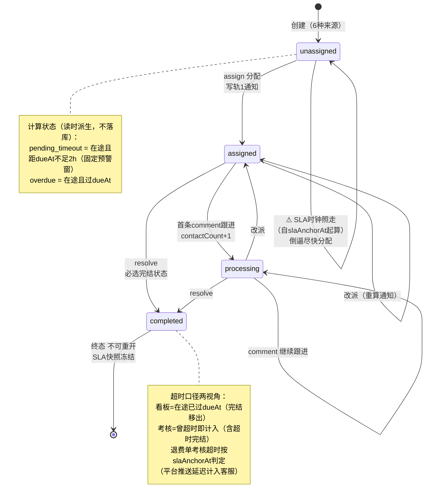
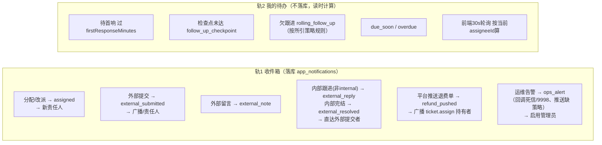

# InsureDesk 系统全景图

数据模型 + 业务逻辑一张图。配套词汇定义见 [CONTEXT.md](../CONTEXT.md)。

## 总览大图

```mermaid
flowchart TB
    subgraph  actors["角色（Actor）"]
        CS["一线客服<br/>ticket.view/process"]
        SUP["客服主管<br/>分配·考核·看板"]
        ADM["管理员<br/>唯一系统角色<br/>恒拥全部正向权限点"]
        EXT["外部账号<br/>提交方（保司/经纪）<br/>凭证+6项预填"]
        JB["骏伯保险平台<br/>推送退费单 / 接收回调"]
    end

    subgraph  web["前端 apps/web（页面）"]
        direction LR
        P_LOGIN["登录 Login"]
        P_TICK["工单列表/详情<br/>tickets + ticket-surface 深模块"]
        P_EXT["我的工单（外部）<br/>external-tickets"]
        P_DASH["看板 dashboard"]
        P_TODO["铃铛·收件箱+我的待办"]
        P_SCHED["排班 schedule"]
        P_CFG["系统配置<br/>字典(含种类)/SLA/班次/角色/用户/外部账号"]
    end

    subgraph  api["API apps/api（tRPC routers）"]
        direction LR
        R_AUTH["auth"]
        R_TICK["ticket"]
        R_EXTT["external-ticket"]
        R_DASH["dashboard"]
        R_NOTI["notification"]
        R_SCHED["schedule / shift-type"]
        R_CFG["role / user / sla / external-account<br/>+ 目录六 router：channel / ticket-category /<br/>completion-status / user-feedback-channel /<br/>feedback-receive-channel / ticket-kind<br/>（共用 dictionary-catalog 目录工厂）"]
        R_FILE["routes: 导入(+模板)/导出<br/>（xlsx 文件流）"]
        R_PUSH["routes: jb-insurance-push<br/>（平台推送退费单 JSON）"]
        R_DEMO["demo（仅 RBAC 守卫<br/>测试探针，非业务）"]
    end

    subgraph  svc["服务层 services（业务逻辑）"]
        S_LIFE["生命周期<br/>create→assign→comment→resolve<br/>ticket-assign/comment/resolve/edit/delete"]
        S_SLA["SLA 时钟<br/>锚=slaAnchorAt<br/>dueAt/预警/首响/跟进检查点<br/>sla + todo（读时计算）"]
        S_DUP["查重<br/>ticket-duplicate<br/>保单号+电话交叉命中<br/>推送单不查重"]
        S_IMP["批量导入/整批撤销<br/>ticket-import(+batch)"]
        S_EXP["导出 xlsx<br/>ticket-export / external-ticket-export"]
        S_SCOPE["数据范围 data-scope<br/>全部/个人(assignee+creator)"]
        S_NOTI["通知两轨<br/>轨1事件落库 / 轨2待办读时算"]
        S_DUTY["在岗判定<br/>排班+墙钟时段<br/>schedule"]
        S_PUSH["推送落库 refund-push<br/>盖章+幂等+盖默认策略"]
        S_CB["回调投递 callback-delivery<br/>outbox+进程内轮询 worker<br/>唯一后台任务"]
    end

    subgraph  db["PostgreSQL 19 张表"]
        direction TB
        T_TICK[("tickets 工单<br/>核心实体")]
        T_DETAIL[("ticket_complaint_details 投诉侧表 1:1<br/>ticket_refund_details 退费侧表 1:1")]
        T_PLOG[("process_logs<br/>处理记录·时间线")]
        T_BATCH[("ticket_import_batches<br/>导入批次=撤销单位")]
        T_CB[("callback_deliveries<br/>回调投递 outbox")]
        T_USER[("users 用户<br/>内外同表<br/>外部带6项预填")]
        T_ROLE[("roles 角色<br/>权限点数组")]
        T_SESS[("sessions 会话<br/>httpOnly cookie")]
        T_KIND[("ticket_kinds 工单种类<br/>行为按 key 绑代码")]
        T_DICT[("字典目录五件套<br/>channels 反馈渠道<br/>ticket_categories 客诉类别<br/>completion_statuses 完结状态<br/>user_feedback_channels 用户反馈渠道<br/>feedback_receive_channels 反馈接收渠道")]
        T_SLA[("sla_policies 时效策略<br/>按种类分组")]
        T_SHIFT[("shift_types 班次定义")]
        T_SCHED[("schedules 排班<br/>user×date 唯一")]
        T_NOTI[("app_notifications<br/>轨1收件箱")]
    end

    CS --> P_TICK
    SUP --> P_TICK & P_DASH & P_SCHED
    ADM --> P_CFG
    EXT --> P_EXT
    JB --> R_PUSH
    P_LOGIN --> R_AUTH
    ALL["全部页面"] -.-> P_TODO --> R_NOTI

    P_TICK --> R_TICK & R_FILE
    P_EXT --> R_EXTT
    P_DASH --> R_DASH
    P_SCHED --> R_SCHED
    P_CFG --> R_CFG

    R_TICK --> S_LIFE & S_DUP & S_SLA
    R_FILE --> S_IMP & S_EXP
    R_PUSH --> S_PUSH
    R_EXTT --> S_LIFE
    R_DASH --> S_SLA
    R_NOTI --> S_NOTI
    R_TICK & R_EXTT & R_DASH --> S_SCOPE
    R_SCHED --> S_DUTY

    S_LIFE --> T_TICK & T_PLOG & T_NOTI & T_DETAIL & T_CB
    S_PUSH --> T_TICK & T_DETAIL & T_NOTI
    S_CB --> T_CB
    S_IMP --> T_BATCH & T_TICK
    S_SLA --> T_SLA & T_TICK
    S_SCOPE --> T_TICK & T_USER
    S_NOTI --> T_NOTI
    S_DUTY --> T_SCHED & T_SHIFT
    R_AUTH --> T_USER & T_SESS
    R_CFG --> T_ROLE & T_DICT & T_SLA & T_USER & T_KIND
    S_CB -.AES 回调.-> JB
    T_TICK & T_DETAIL -.引用.-> T_DICT
    T_TICK -.种类.-> T_KIND
    T_SLA -.分组.-> T_KIND
    T_TICK -.责任人/创建人.-> T_USER
    T_USER -.角色.-> T_ROLE
```

## 数据模型（ER）

```mermaid
erDiagram
    roles ||--o{ users : "roleId"
    users ||--o{ sessions : "userId"
    users ||--o{ tickets : "assigneeId 责任人"
    users ||--o{ tickets : "creatorId 创建人/外部提交者"
    users ||--o{ schedules : "userId"
    users ||--o{ app_notifications : "targetUserId"
    users ||--o{ ticket_import_batches : "importerId"
    users }o--o| channels : "prefillChannelId 预填 Restrict"
    users }o--o| user_feedback_channels : "prefill Restrict"
    users }o--o| feedback_receive_channels : "prefill Restrict"

    ticket_kinds ||--o{ tickets : "kindId Restrict"
    ticket_kinds ||--o{ sla_policies : "kindId 分组 Restrict"
    sla_policies |o--o{ tickets : "slaPolicyId 可空 Restrict"
    tickets ||--o| ticket_complaint_details : "1:1 Cascade 投诉单"
    tickets ||--o| ticket_refund_details : "1:1 Cascade 退费单"
    tickets ||--o{ callback_deliveries : "Cascade"
    tickets ||--o{ process_logs : "ticketId 级联删"
    ticket_complaint_details }o--o| channels : "channelId Restrict"
    ticket_complaint_details }o--o| ticket_categories : "categoryId Restrict"
    ticket_complaint_details }o--o| user_feedback_channels : "Restrict"
    ticket_complaint_details }o--o| feedback_receive_channels : "Restrict"
    tickets }o--o| completion_statuses : "completionStatusId Restrict"
    tickets }o--o| ticket_import_batches : "importBatchId Restrict"
    shift_types ||--o{ schedules : "shiftId"

    tickets {
        string workOrderNumber "WO+全局序列"
        string source "6种录入方式 manual/feishu_form/community/external_channel/file_import/jb-insurance"
        string kindId "种类引用"
        datetime slaAnchorAt "SLA计时锚盖章 投诉=createdAt 退费=refundCreateTime"
        string slaPolicyId "策略引用 可空=未定级"
        string status "仅4基础状态 unassigned/assigned/processing/completed"
        datetime dueAt "slaAnchorAt+超时时长 分配不重算"
        datetime deletedAt "软删除"
        text submissionText "外部提交原文"
    }
    ticket_complaint_details {
        string ticketId "PK即FK 投诉类工单专属"
        string channelId "反馈渠道引用 可空"
        string categoryId "客诉类别引用 可空"
        string_array policyNumbers "多值保单号"
        string priority "自由标签 与SLA无关"
    }
    ticket_refund_details {
        string platform "推送平台"
        string endorNo "批单号 (platform,endorNo)复合唯一=推送幂等键"
        datetime refundCreateTime "slaAnchorAt 盖章来源"
        string expectedAmount "金额一律 String 原样存取"
        string_array pushedFields "实收字段清单 此后只读"
    }
    callback_deliveries {
        string status "pending/delivered/dead"
        string endorNo "载荷快照 完结时刻锁定 此后不回读工单"
        datetime nextAttemptAt "退避5m→30m→2h 自首试24h转死信"
    }
    roles {
        string_array permissions "权限点 含限制类(勾选=禁止)"
        string_array requiredTicketFields "建单必填字段集"
        bool system "仅管理员 true"
    }
    users {
        string username "唯一登录名"
        string feishuUserId "预留飞书SSO"
        string prefillChannelId "外部预填1/6"
        string prefillProject "外部预填2/6 项目保司"
    }
    sla_policies {
        string name "全表唯一 含停用行"
        string kindId "按种类分组 sortOrder 组内序"
        int firstResponseMinutes "首响红线"
        int overdueHours "超时时长 null=不设处理时限"
        json reminderRules "类型化提醒规则"
        bool active "只启停 无物理删除"
    }
    ticket_kinds {
        string key "行为绑定key=代码契约 不可改"
        bool active "行为绑定行只启停 不物理删除"
    }
    process_logs {
        string action "8种 含external_note"
        string operatorName "姓名快照 不随改名改写"
        bool internalOnly "true=外部不可见"
    }
    app_notifications {
        string type "assigned/external_*/refund_pushed/ops_alert"
        bool read "未读角标"
    }
    schedules {
        string date "墙钟日期 user+date 唯一"
        string remark "备注"
    }
```

## 工单生命周期与 SLA

## 通知两轨制

## 关键设计取舍速查

| 主题 | 取舍 |
|---|---|
| 枚举值 | 中文枚举值存 String，真相源在 `packages/shared/src/enums.ts`，Zod 在 API 边界执法 |
| 字典目录 | 工单存引用不存快照；改名全局生效；被引用行只能停用（DB 层 Restrict 兜底） |
| 工单种类 | 种类元数据是目录数据（管理员可维护）；种类行为（录入通道/详情模块/完结回调/SLA计时锚）按稳定 key 类型化绑代码；行为绑定行只启停、不物理删除、key 不可改（ADR-0001） |
| 状态 | 只存 4 个基础状态；pending_timeout/overdue 读时计算 |
| SLA | 时效策略（sla_policies）引用唯一驱动，按种类分组；时钟自 slaAnchorAt 起算（投诉单=createdAt，退费单=平台推送的 refundCreateTime，ADR-0002），与分配无关；dueAt 建单盖章、改策略引用重盖章、分配/改派永不重算；完结冻结快照；旧 complaintLevel 文本轨已下线（输入即报错） |
| 退费推送 | 退费单唯一生产者=骏伯推送 API（source=jb-insurance）；(platform,endorNo) 幂等键；实收字段此后只读、金额一律 String 原样存取；推送单不跑查重；入单即广播通知 |
| 回调投递 | 唯一后台任务：完结事务内落 outbox 行，进程内轮询 worker 串行投递，at-least-once（平台幂等吸收重复）；退避 5m→30m→2h，自首试 24h 或平台 9998 转死信并告警管理员；完结不阻塞于回调成功（ADR-0003） |
| 历史 | ProcessLog/通知存姓名与工单号快照，operatorId 故意不设 FK——改名/离职不改写历史 |
| 权限 | 角色=权限点数组；数据范围仅全部/个人两档；限制类权限勾选=禁止；管理员恒拥全量正向权限 |
| 外部账号 | 全库恰好一个外部角色（按库中权限数组判定）；只看自己提交的工单；导出恒开无权限点；PII 全量展示（原文本可见） |
| 排班分配 | 在岗=启用+排班+墙钟在时段内；自动分配选名下在途手工单最少者（平手随机），不按渠道路由；无合规在岗者记 no_on_duty 跳过 |
| 导入撤销 | 批次=撤销单位；干净批次（无处理无单删）可整批软删撤销，不可恢复 |
| 删除 | 工单软删除（deletedAt）；ProcessLog/附件保留；本期只删不恢复 |
| 会话 | Postgres 存 session，httpOnly cookie，闲置过期 |
