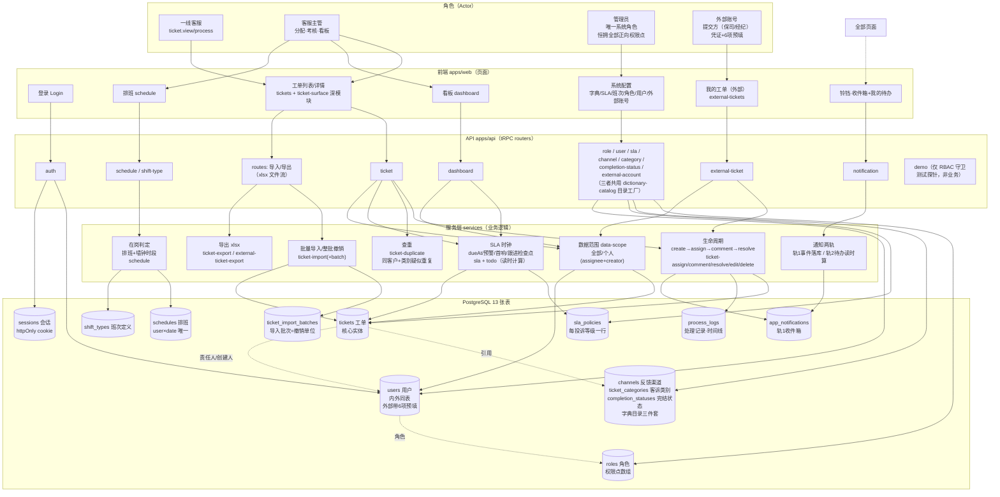
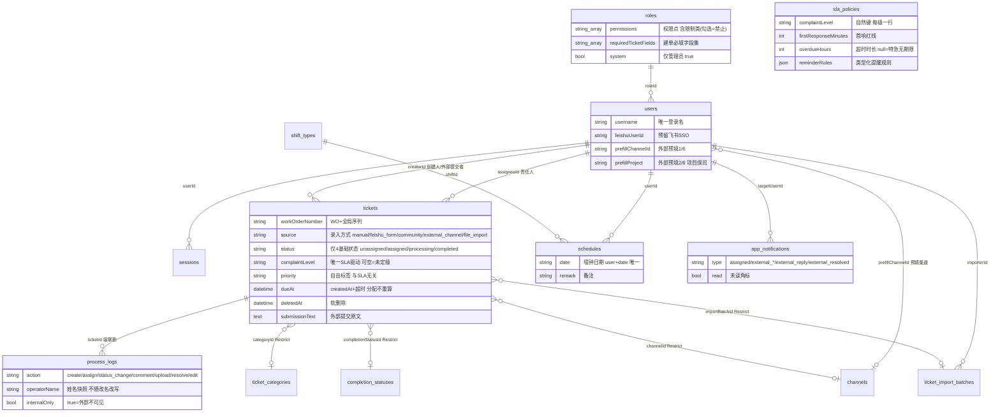
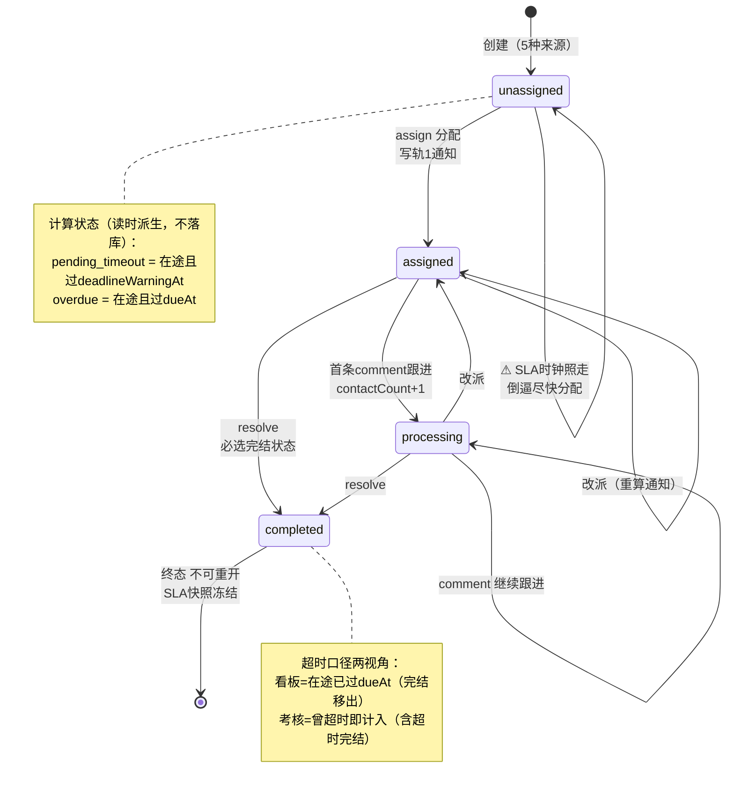
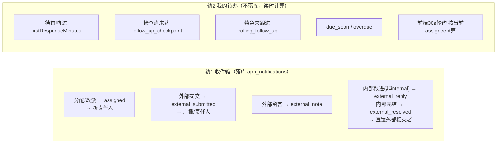

# InsureDesk 系统全景图

数据模型 + 业务逻辑一张图。配套词汇定义见 [CONTEXT.md](../CONTEXT.md)。

## 总览大图

## 数据模型（ER）

## 工单生命周期与 SLA

## 通知两轨制

## 关键设计取舍速查

| 主题 | 取舍 |
|---|---|
| 枚举值 | 中文枚举值存 String，真相源在 `packages/shared/src/enums.ts`，Zod 在 API 边界执法 |
| 字典目录 | 工单存引用不存快照；改名全局生效；被引用行只能停用（DB 层 Restrict 兜底） |
| 状态 | 只存 4 个基础状态；pending_timeout/overdue 读时计算 |
| SLA | complaintLevel 唯一驱动；时钟自 createdAt 起算与分配无关；dueAt 分配/改派永不重算；完结冻结快照 |
| 历史 | ProcessLog/通知存姓名与工单号快照，operatorId 故意不设 FK——改名/离职不改写历史 |
| 权限 | 角色=权限点数组；数据范围仅全部/个人两档；限制类权限勾选=禁止；管理员恒拥全量正向权限 |
| 外部账号 | 全库恰好一个外部角色（按库中权限数组判定）；只看自己提交的工单；导出恒开无权限点；PII 全量展示（原文本可见） |
| 排班分配 | 在岗=启用+排班+墙钟在时段内；自动分配选手工单最少者，不按渠道路由；无合规在岗者记 no_on_duty 跳过 |
| 导入撤销 | 批次=撤销单位；干净批次（无处理无单删）可整批软删撤销，不可恢复 |
| 删除 | 工单软删除（deletedAt）；ProcessLog/附件保留；本期只删不恢复 |
| 会话 | Postgres 存 session，httpOnly cookie，闲置过期 |
